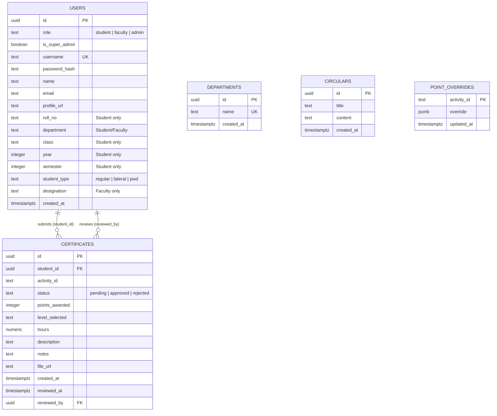

# APMS — Database Schema & ER Diagram

## ER Diagram

---

## Table Details

### 1. `users`
Central table storing all user accounts. The `role` field determines portal access.

| Column | Type | Constraints | Description |
|--------|------|-------------|-------------|
| `id` | UUID | PK, auto-generated | Unique user identifier |
| `role` | TEXT | NOT NULL, CHECK | `student`, `faculty`, or `admin` |
| `is_super_admin` | BOOLEAN | NOT NULL, default `false` | Super admin flag |
| `username` | TEXT | NOT NULL, UNIQUE | Login username |
| `password_hash` | TEXT | NOT NULL | Bcrypt hashed password |
| `name` | TEXT | NOT NULL | Full display name |
| `email` | TEXT | — | Email address |
| `profile_url` | TEXT | — | Profile picture URL |
| `roll_no` | TEXT | — | Student roll number |
| `department` | TEXT | — | Department name |
| `class` | TEXT | — | Class/section |
| `year` | INTEGER | — | Current year of study |
| `semester` | INTEGER | — | Current semester |
| `student_type` | TEXT | CHECK | `regular`, `lateral`, or `pwd` |
| `designation` | TEXT | — | Faculty designation |
| `created_at` | TIMESTAMPTZ | default `now()` | Account creation time |

---

### 2. `departments`
List of academic departments managed by admins.

| Column | Type | Constraints | Description |
|--------|------|-------------|-------------|
| `id` | UUID | PK, auto-generated | Unique department ID |
| `name` | TEXT | NOT NULL, UNIQUE | Department name |
| `created_at` | TIMESTAMPTZ | default `now()` | Creation timestamp |

---

### 3. `certificates`
Core table — each row is a student's activity certificate submission.

| Column | Type | Constraints | Description |
|--------|------|-------------|-------------|
| `id` | UUID | PK, auto-generated | Unique certificate ID |
| `student_id` | UUID | FK → `users.id`, ON DELETE CASCADE | Submitting student |
| `activity_id` | TEXT | NOT NULL | Activity category identifier |
| `status` | TEXT | NOT NULL, default `pending`, CHECK | `pending`, `approved`, or `rejected` |
| `points_awarded` | INTEGER | — | Points given after review |
| `level_selected` | TEXT | — | Level (College/State/National/etc.) |
| `hours` | NUMERIC | — | Hours spent on activity |
| `description` | TEXT | — | Activity description |
| `notes` | TEXT | — | Faculty review notes |
| `file_url` | TEXT | — | Uploaded certificate file URL |
| `created_at` | TIMESTAMPTZ | default `now()` | Submission time |
| `reviewed_at` | TIMESTAMPTZ | — | Review timestamp |
| `reviewed_by` | UUID | FK → `users.id` | Reviewing faculty |

---

### 4. `circulars`
Announcements and notices posted by admins.

| Column | Type | Constraints | Description |
|--------|------|-------------|-------------|
| `id` | UUID | PK, auto-generated | Unique circular ID |
| `title` | TEXT | NOT NULL | Circular title |
| `content` | TEXT | NOT NULL | Circular body |
| `created_at` | TIMESTAMPTZ | default `now()` | Post timestamp |

---

### 5. `point_overrides`
Admin-configurable overrides for default activity point values.

| Column | Type | Constraints | Description |
|--------|------|-------------|-------------|
| `activity_id` | TEXT | PK | Activity category identifier |
| `override` | JSONB | NOT NULL | Custom point rules as JSON |
| `updated_at` | TIMESTAMPTZ | default `now()` | Last updated timestamp |

---

## Relationships Summary

| Relationship | Type | Description |
|---|---|---|
| `users` → `certificates` (student_id) | One-to-Many | A student submits many certificates |
| `users` → `certificates` (reviewed_by) | One-to-Many | A faculty member reviews many certificates |

---

## Indexes

| Index | Table | Column(s) | Purpose |
|-------|-------|-----------|---------|
| `idx_certificates_student_id` | certificates | student_id | Fast lookup of a student's submissions |
| `idx_certificates_status` | certificates | status | Quick filtering by review status |
| `idx_users_username` | users | username | Fast login lookups |
| `idx_users_role` | users | role | Quick role-based queries |
| `idx_users_department` | users | department | Department-based filtering |

---

## Security

All tables have **Row Level Security (RLS)** enabled. The backend uses the Supabase `service_role` key, which bypasses RLS for server-side operations.

---

## Prompt for AI Image Generator (Google Gemini / etc.)

> **Copy-paste this prompt to generate a visual ER diagram:**
>
> Create a clean, professional Entity-Relationship (ER) diagram for a database with the following 5 tables:
>
> 1. **users** — columns: id (UUID, PK), role (text: student/faculty/admin), is_super_admin (boolean), username (text, unique), password_hash (text), name (text), email (text), profile_url (text), roll_no (text), department (text), class (text), year (integer), semester (integer), student_type (text: regular/lateral/pwd), designation (text), created_at (timestamptz)
>
> 2. **certificates** — columns: id (UUID, PK), student_id (UUID, FK → users.id), activity_id (text), status (text: pending/approved/rejected), points_awarded (integer), level_selected (text), hours (numeric), description (text), notes (text), file_url (text), created_at (timestamptz), reviewed_at (timestamptz), reviewed_by (UUID, FK → users.id)
>
> 3. **departments** — columns: id (UUID, PK), name (text, unique), created_at (timestamptz)
>
> 4. **circulars** — columns: id (UUID, PK), title (text), content (text), created_at (timestamptz)
>
> 5. **point_overrides** — columns: activity_id (text, PK), override (jsonb), updated_at (timestamptz)
>
> Relationships:
> - users (1) ──→ (many) certificates via student_id (a student submits many certificates)
> - users (1) ──→ (many) certificates via reviewed_by (a faculty reviews many certificates)
> - departments and circulars are standalone tables managed by admins
> - point_overrides is a standalone config table
>
> Use a light background, rounded table boxes, primary keys highlighted, foreign keys shown with arrows. Use a modern, clean diagram style suitable for a college project report.
